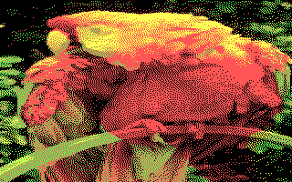

# CGA Image Converter
This is a port of my [python script](https://github.com/MasonGulu/cga-imagemaker) to Java.

This program takes in an image, quantizes it, and interlaces/modifies the data to be loaded 
directly into CGA ram. Optionally adding a small "loader" to the start and exporting as a COM file. This COM
file can then be run on a CGA compatible computer and will display the image, waiting for a key-press before closing.

This requires Java 17 to be installed.

## Quickstart
If you want to take a picture and convert it to a com-file with little regards for anything else, then run this
`java -jar cgaimage.jar <mode> <inputfile> -com <outputfile.com>`. See a list of modes in [Usage](#usage).
For a demo of all modes see [Demo](#demo).

## Usage
```
CGA Image Generator version 1
usage: cgaimage mode image [-all] [-com <arg>] [-d] [-interlaced <arg>]
[-post <arg>] [-raw <arg>] [-resize]
Convert an image into a CGA compatible format.

-all                Generate this image in every mode
-com <arg>          Generate com file
-d,--dither         Do dithering
-interlaced <arg>   Path to raw interlaced binary files
-post <arg>         Path to post-processed image
-raw <arg>          Path to raw binary file
-resize             Resize the images to native CGA resolution
--------------Modes-------------
320x200 4 color | 2b0L 2b1L 2b5L
...             | 2b0H 2b1H 2b5H
640x200 2 color | 1b
80 x100 256     | 2Bo0 2bo1 2bn0 2Bn1
80 x100 512     | 2Bo       2bn
```

## Demo
All demos shown are of 


Image from [Wikipedia](https://en.wikipedia.org/wiki/List_of_8-bit_computer_hardware_graphics)

These images are processed with the args `-post <filename> -resize -d`

No attempts were made to keep the aspect ratio on these images consistent.

The post argument resizes images to maintain the aspect ratio that they would have when displayed on a CGA computer.

| Category        | Mode | Image                        | Notes                                                                    |
|-----------------|------|------------------------------|--------------------------------------------------------------------------|
| 640x200 2 color | 1b   |    | The pixels are 1x2                                                       |
| 320x200 4 color | 2b0L |  | The pixels are 1x1                                                       |
|                 | 2b0H |  |                                                                          |
|                 | 2b1L |  |                                                                          |
|                 | 2b5H |  |                                                                          |
|                 | 2b5L |  |                                                                          |
|                 | 2b5H |  |                                                                          |
| 80 x100 256 col | 2Bo0 |  | Composite colors, these vary between "new" and "old" CGA. Pixels are 2x1 |
|                 | 2Bo1 |  |                                                                          |
|                 | 2Bn0 |  |                                                                          |
|                 | 2Bn1 |  |                                                                          |
| 80 x100 512 col | 2Bo  |   | Combinations of the 256 color palettes                                   |
|                 | 2Bn  |   |                                                                          |


## Building
This project was built in intellij IDEA with commons-cli-1.5 and commons-io-2.11